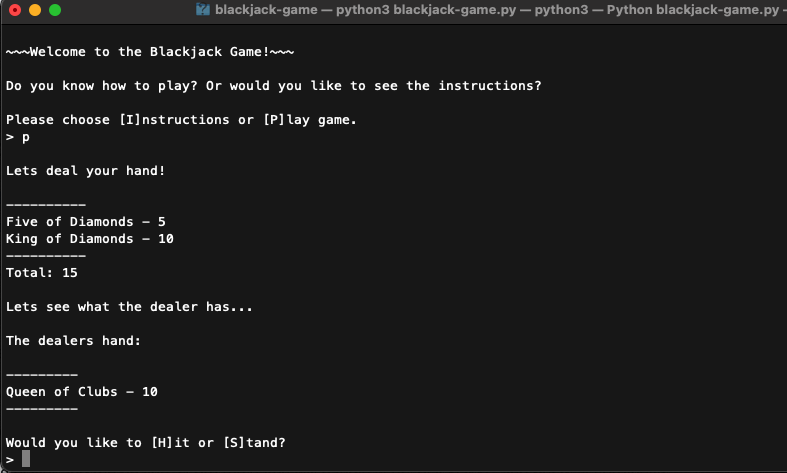
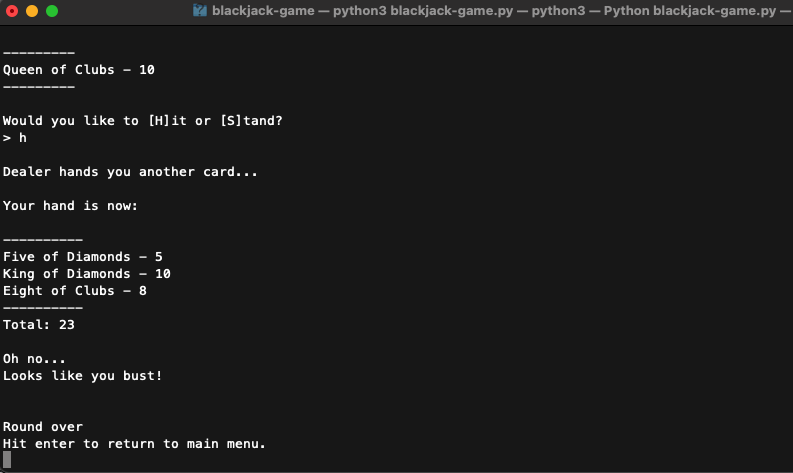

# Blackjack Game

## Contents

-   [About the Game](#about)
-   [Installation](#installation)
    <br>
    <br>

## <a name="about"></a>About the Game

I created this game as a part of the Hackbright prep course. It is a command line game that allows you to play blackjack against a dealer using simple key commands.

You can view intructions or play the game.
<br>
<br>

<br>
<br>
The game will total the cards for you and you can decide if you would like to hit or stay.
<br>
<br>

<br>
<br>
Based on the player and the dealers score the game will handle aces, blackjacks, and busts accordingly!
<br>
<br>

## <a name="installation"></a> Installation

<br>

To download and play the game complete the following steps:<br>

1. Install [Python3](https://www.python.org/downloads/mac-osx/)
   <br>

2. Clone or fork the repository:

```
$ git clone https://github.com/singram11/blackjack-game
```

3. Run the file in the command line:

```
$ python3 blackjack-game.py
```

Get playing!
